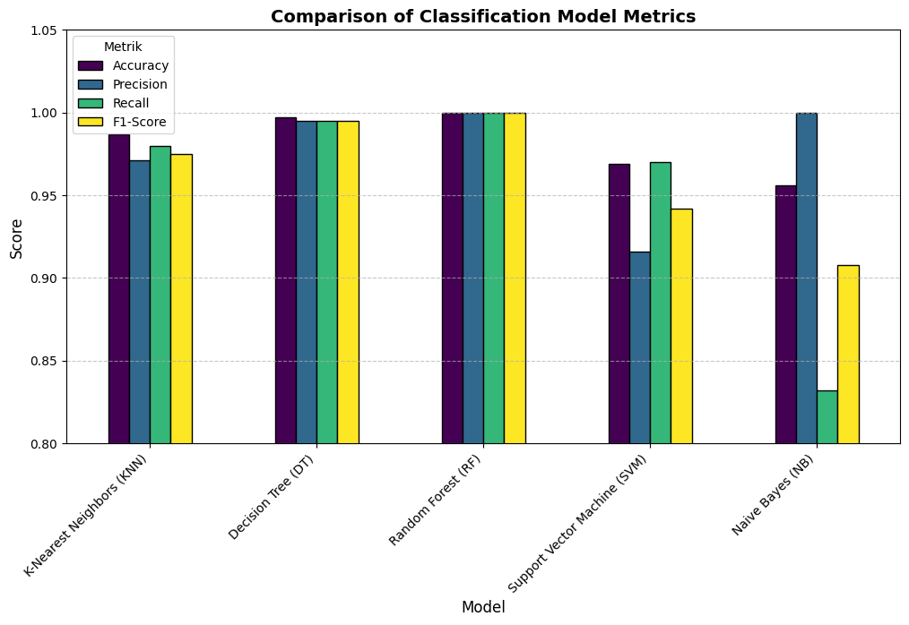

# Customer Segmentation: Consumer Shopping Latest Trends 🛒

## 🕐 Clustering
In this project, I performed unsupervised clustering of data on the consumer shopping latest trends database. Customer segmentation is the practice of separating customers into groups that reflect similarities among customers in each cluster. I came up with 4 clusters and further used them in customer behavior in clusters according to their average purchase, previous purchases, gender, subscription and discount/promo. This can be used in planning better marketing strategies.

### Defining Cluster
📌 Cluster 0
- Gender: Male
- Average Purchase Amount: $80.09
- Subscription: No
- Discount Applied: No
- Previous Purchases: 13.21
- Analysis: This cluster consists of moderate spenders with medium purchase activity. They make purchases but are not heavily engaged in loyalty programs or discounts.
- Business Implications:
    - Target with mid-range products and promotional incentives.
    - Encourage loyalty program adoption to increase retention.


📌 Cluster 1
- Gender: Male
- Average Purchase Amount: $80.30
- Subscription: No
- Discount Applied: No
- Previous Purchases: 38.50
- Analysis: This cluster represents high-value customers with consistent purchase activity. They are premium buyers who tend to make frequent purchases.
- Business Implications:
    - Offer exclusive products or early access deals to retain loyalty.
    - Introduce bundling or premium memberships to increase lifetime value.


📌 Cluster 2
- Gender: Male
- Average Purchase Amount: $39.20
- Subscription: No
- Discount Applied: No
- Previous Purchases: 37.13
- Analysis: These customers exhibit low spending behavior but have high previous purchase activity. They may prefer affordable products and be selective shoppers.
- Business Implications:
    - Offer targeted discounts or product recommendations to boost spending.
    - Introduce subscription incentives for long-term engagement.


📌 Cluster 3
- Gender: Male
- Average Purchase Amount: $38.83
- Subscription: No
- Discount Applied: No
- Previous Purchases: 12.53
- Analysis: This group consists of low spenders with infrequent purchases. They are price-sensitive and cautious buyers who might need stronger incentives to engage.
- Business Implications:
    - Implement special promotions or cashback offers to drive conversion.
    - Implement special promotions or cashback offers to drive conversion.


## 🕑 Classification
The clusters will be used as labels or categories to build a classification model. The algorithms used for model training include KNeighborsClassifier, DecisionTreeClassifier, RandomForestClassifier, SVC, and GaussianNB. The results of the model evaluation obtained that Random Forest is the best performing model, outperforming the other models in terms of accuracy, precision, recall, and F1-Score. This demonstrates its ability to identify customer segmentation better and more accurately, making it a prime candidate for further implementation.

### Classification Result
<p align="center">
  


## 🕒 Setup Environtment

### Setup Environment - Shell/Terminal

```
mkdir project_consumer_shopping_latest_trends
cd project_consumer_shopping_latest_trends
pipenv install
pipenv shell
pip freeze > requirements.txt
```
